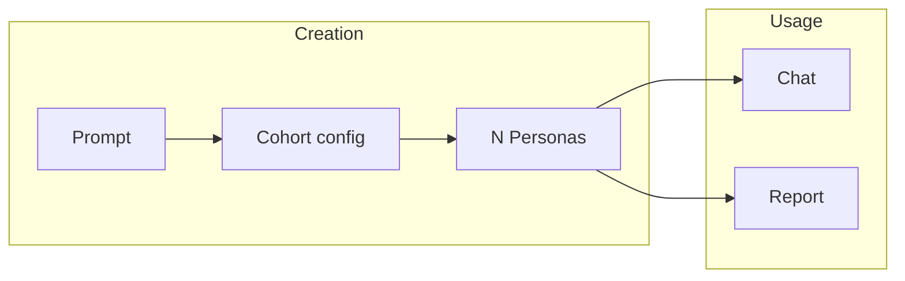

# Mass: concepts

Mass is an AI-powered social simulation platform. You test ideas, concepts, products, pitches, and social experiments against many diverse AI personas from the command line. All usage is via the `mass` CLI; there is no API, GraphQL, or web UI.

## Main concepts

### Cohorts

A **cohort** is a named group defined by a text prompt (e.g. "UK parents, 25-45"). The LLM turns this prompt into a weighted cohort config: demographics, locations, and other dimensions. Cohorts do not contain persona text; they define *who* to generate. You then create one or more personas from that cohort (1-10 per run).

### Personas

**Personas** are LLM-generated characters. Each has:

- **Name** and a long **backstory** (the `persona` text used by the LLM when replying).
- **Structured metadata:** age, gender, pronouns, location, job, education, personality traits, relationship status, and similar fields.
- **Optional extended metadata:** lifestyle, health, values, tech savviness, communication style, and more.
- **Username** (for mentions and identification).
- **Optional connections** to other personas.

Personas are stored as one JSON file per persona under `data/personas/<id>/<id>.json`. See [Data layout](data-layout.md) and [Creating cohorts and personas](creating-personas.md).

### Workspaces

**Workspaces** hold conversation state (messages). They are used by:

- **Chat:** so you can continue a thread with a persona across invocations.
- **Report generation:** the prompt and report context live in a workspace.

You can list, delete, rename, and fork workspaces (fork at a message to branch the conversation). See [Workspaces](workspaces.md) and [Chat](chat.md).

### Reports

**Reports** are batch runs that ask a cohort (or an explicit list of personas) a question and aggregate the results. Four types are available:

- **feedback:** sentiment, quotes, summary, verdict (positive / neutral / negative).
- **debate:** for/against views, persona positions, verdict.
- **questionnaire:** extract questions from the prompt; each persona answers; aggregated view.
- **ideas:** idea generation and aggregation.

Output is JSON (stored under `reports/`) plus optional HTML export. See [Reports](reports.md).

## Flow

1. You provide a **prompt** (e.g. "UK parents, 25-45").
2. **Cohort create** turns it into a cohort config and optionally creates personas.
3. **Persona create** (if not done in one go) adds more personas to an existing cohort.
4. You **chat** with a single persona or run a **report** over a cohort (or persona list) to test an idea or question.

## Next steps

- [Examples](examples.md): in-depth walkthroughs (product feedback, persona interview, report types).
- [Setup](setup.md): install and environment.
- [Creating cohorts and personas](creating-personas.md): cohort and persona commands.
- [Chat](chat.md): talking to a persona.
- [Reports](reports.md): generating and viewing reports.
- [Testing personas](testing-personas.md): how to test personas in practice.
